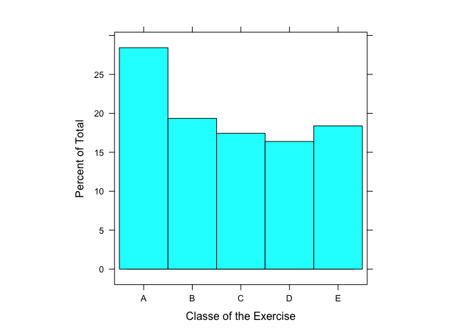
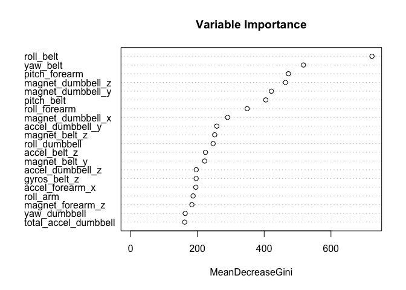

# Practical Machine Learning Prediction Assignment Writeup - Weight Lifting Exercises
by Margarida Freire  
`r Sys.Date()`  

  
## Synopsis  

This report aims to describe the process used to built a predictive model in order to analyse the quality of weight lifting exercises by predicting how well an activity was performed. it was used data from accelerometers on the belt, forearm, arm, and dumbell of 6 participants who performed a set of 10 repetitions of the exercise in five different manners classified into classes (A, B, C,D and E). class A relates to the exercise performed correctly, i.e. exactly according to the specification and the other classes correspond to different manners of performing the exercise incorrectly (the data for this project come from [this source]: http://groupware.les.inf.puc-rio.br/har). To make these predictions, I started by testing the performance of two different tree-based classification methods in R, the Random Forests and Boosting with gbm method. The choosen model was the one fitted with Random Forests method because it proved to be the most accurate, with approximately 99% accuracy. The Boosting model can't be used. It missed many values in classifying items. Its error rate was around 33%, with a correspondent accuracy of only 67%.
Finally, I use the chosen prediction model to predict 20 different new test cases.  
  
  
___  
  
    
## Loading and Processing the Raw Data  
  
    
### Loading the data


```r
# Clear the environment workspace
rm(list=ls())

# Create the 'data' folder if it does not exist.
if(!file.exists("./data")){dir.create("./data")}
        
## Checks whether pml-training.csv and pml-testing.csv files exist, if not then it downloads them transforming empty values and '#DIV/0!' in NA's

if(!file.exists("./data/pml-training.csv") | 
                 !file.exists("./data/pml-testing.csv")) {
       
        fileUrl1 <- "https://d396qusza40orc.cloudfront.net/predmachlearn/pml-training.csv"
        fileUrl2 <- "https://d396qusza40orc.cloudfront.net/predmachlearn/pml-testing.csv"
        
                os <- Sys.info()['sysname']
                
                if (!os %in% "Windows") {
                        
                        download.file(fileUrl1, destfile ="./data/pml-training.csv", method = "curl")
                        download.file(fileUrl2, destfile ="./data/pml-testing.csv", method = "curl")
                }
                        
                else {
                        download.file(fileUrl1, destfile ="./data/pml-training.csv")
                        download.file(fileUrl2, destfile ="./data/pml-testing.csv")
                }
}

# Read the files into R 
data_pmlTrain  <- read.csv("./data/pml-training.csv", colClasses="character", na.strings= c("NA",""," ","#DIV/0!"))
data_pmlTest <- read.csv("./data/pml-testing.csv", colClasses="character", na.strings= c("NA",""," ","#DIV/0!"))
```


  
  
###Processing the Raw data

Processing the raw data aims to clean the data in order to get the features set up so they can be used for prediction.  

After reading the data I checked the first rows of the training set.

```r
head(data_pmlTrain)
```

 
Here, I looked at the structure of this training data set and then I checked what proportion 
of the observations are missing (i.e. coded as NA).

```r
str(data_pmlTrain)
```


```r
mean(is.na(data_pmlTrain))
```

```
## [1] 0.6131835
```
  
The training data set contains 19622 observations of 160 variables. The proportion of missing values is very high (0.6131835), so I looked a little further at the data and concluded that there are many variables (columns) that contains a large sum of NA's, each of those columns have NA's in almost all the rows of the data set, so those columns were removed.  

```r
data_pmlTrain <- data_pmlTrain[, colSums(is.na(data_pmlTrain)) == 0] 

# Check if there still exists any NA's left
sum(is.na(data_pmlTrain))
```

```
## [1] 0
```
There are no more NA's in the training data set.

The first seven columns are not relevant for the predictions needed for this project since the variables of interest are those related to data that logs Weight Lifting activity such as data from accelerometers on the belt, forearm, arm, and dumbell. So, those irrelevant columns were also removed.

```r
data_pmlTrain <- data_pmlTrain[,8:ncol(data_pmlTrain)]
dim(data_pmlTrain)
```

```
## [1] 19622    53
```
Now the data set has only 53 variables that are the predictors.  
  
  
Next, I transform the "classe" variable into a factor just so R interpret the values properly.

```r
data_pmlTrain$classe <- as.factor(data_pmlTrain$classe)
```


___  
 
  
## Data Splitting
It was used data splitting/partition for building the training and testing sets and to do cross validation within the training set in order to evaluate the model.

The data Partition is based on the 'classe' variable as the outcome in order to predict the manner in which the exercises were done (i.e. classe: A, B, C, D or E).

```r
library(caret)
library(kernlab)

# The sample is small so about 60% of the data is set to be in the training set
inTrain <- createDataPartition(y=data_pmlTrain$classe, p = 0.60, list = FALSE)
training <- data_pmlTrain[inTrain,]
testing <- data_pmlTrain[-inTrain,]

# Just to see the training set dimension
dim(training)
```

```
## [1] 11776    53
```
  
  
The next histogram shows the proportion (percentage) that each 'classe' variable appears among the data set relative to the total. This gives me already a general idea of how the different manners of weight lifting (classes) are distributed within this dataset before I perform the predictions.

```r
require( lattice )
histogram( ~as.factor( training$classe ), aspect = 1,  xlab = "Classe of the Exercise")
```

\

We can see that in general the 'classe A', i.e. exercise performed exactly according to the specification, is more prevalent (it has the higher percentage) comparing to each one of the other four classes that corresponds to the exercise being executed with common mistakes.  
  
___  
  
  
## Fit the Models and Cross-Validation  

In order to build the train model and then predict new values, it was tested the performance of two different tree-based classification methods in R. First it was checked the performance for the Random Forest, with randomForest method, then it was checked Boosting, with gbm method. The reason for the choose of these methods is based on the fact that they are the most accurate out of the box classifiers for tree-based classification.  

  
  
### Building the Models  
  
  

####<u>Random Forests</u>

Random Forests is known for being one of the most accurate method for prediction, however, it is prone to overfitting, especially when it has few trees. Generally, the tendency to overfit decreases as the number of trees increase, so, In order to minimize this tendency, we use cross-validation as a tuning parameter.


```r
library(randomForest)

# Set the seed to reproducibility
set.seed(1234) 

# Fit a model with randomForest method, all predictors and 'classe' variable as the outcome variable 
modFit_rf <- randomForest(classe ~ ., data = training, ntree=300, 
                       trControl = trainControl(method = "cv", number = 5))
modFit_rf
```

```
## 
## Call:
##  randomForest(formula = classe ~ ., data = training, ntree = 300,      trControl = trainControl(method = "cv", number = 5)) 
##                Type of random forest: classification
##                      Number of trees: 300
## No. of variables tried at each split: 7
## 
##         OOB estimate of  error rate: 0.63%
## Confusion matrix:
##      A    B    C    D    E  class.error
## A 3346    2    0    0    0 0.0005973716
## B   12 2258    9    0    0 0.0092145678
## C    0   15 2036    3    0 0.0087633885
## D    0    0   22 1905    3 0.0129533679
## E    0    0    2    6 2157 0.0036951501
```
The OOB estimate error rate and the confusion matrix show a highly accurate prediction besides some missing values that exhibit very low error rates.  
  
  
Next, we plot the model to see the relation between the number of trees and the estimated error rate.

```r
plot(modFit_rf, main="Number of trees vs Estimate Error Rate")
```

\

The plot above shows that with this model the error rate decreases and stabilizes rapidly as the number of trees increases until approximately 50 trees. From 50 trees forward the error is pretty much the same regardless the increasing number of trees.  
  
    
    
***Variable Importance***
  
  
The next plot shows the importance of the variables for predicting, which represents the mean decrease in node impurity.

```r
varImpPlot(modFit_rf,type=2, main = "Variable Importance",sort = T, n.var = 20) 
```

\

  
  
***Cross-Validation***  
  
  
Random Forests creates a set of bootstrap samples with new classifiers that are not included in the original data set, these bootstrap samples are the Out-Of-Bag (OOB) data sets. Using out-of-bag estimate internally during the run, this method outcomes very accurate predictions with unbiased estimate of the test set error. Nonetheless, below we cross-validate the model for the remaining 40% of the observations within the testing set.

```r
# Test the model on the testing dataset
pred <- predict(modFit_rf, newdata=testing)

# Analyse the accuracy of the prediction by confronting it with the class values in the testing set  
table(pred, testing$classe)
```

```
##     
## pred    A    B    C    D    E
##    A 2227   11    0    0    0
##    B    4 1499    5    0    0
##    C    0    8 1362   19    3
##    D    0    0    1 1265    4
##    E    1    0    0    2 1435
```
Here, we can see that despite some missed values, the overall prediction is highly accurate. 
Further in this document it is shown the accuracy values for the predictions.  
  
  
  
***Confusion Matrix***  
  
    
Applying the Confusion Matrix give us information about model accuracy, i.e. how well the model does on new data sets.

```r
confMatrix_rf <- confusionMatrix(pred, testing$classe)
confMatrix_rf
```

```
## Confusion Matrix and Statistics
## 
##           Reference
## Prediction    A    B    C    D    E
##          A 2227   11    0    0    0
##          B    4 1499    5    0    0
##          C    0    8 1362   19    3
##          D    0    0    1 1265    4
##          E    1    0    0    2 1435
## 
## Overall Statistics
##                                           
##                Accuracy : 0.9926          
##                  95% CI : (0.9905, 0.9944)
##     No Information Rate : 0.2845          
##     P-Value [Acc > NIR] : < 2.2e-16       
##                                           
##                   Kappa : 0.9906          
##  Mcnemar's Test P-Value : NA              
## 
## Statistics by Class:
## 
##                      Class: A Class: B Class: C Class: D Class: E
## Sensitivity            0.9978   0.9875   0.9956   0.9837   0.9951
## Specificity            0.9980   0.9986   0.9954   0.9992   0.9995
## Pos Pred Value         0.9951   0.9940   0.9784   0.9961   0.9979
## Neg Pred Value         0.9991   0.9970   0.9991   0.9968   0.9989
## Prevalence             0.2845   0.1935   0.1744   0.1639   0.1838
## Detection Rate         0.2838   0.1911   0.1736   0.1612   0.1829
## Detection Prevalence   0.2852   0.1922   0.1774   0.1619   0.1833
## Balanced Accuracy      0.9979   0.9930   0.9955   0.9915   0.9973
```
  
  
####<u>Boosting - gbm</u>  

Boosting, is an aggregation method that takes a bunch of weak predictors, weight them and then add them up into more significant (stronger) ones before creating subsequent trees. This process reduce error on the poorly classified observations. Along with the random forests, this is one of the most accurate model for out of the box classifiers. To fit the model I used 3-fold cross-validation so that gbm, besides running it's usual fit algorithm, also perform cross-validation with three folds.


```r
library(gbm)

# Transforming character variables into numeric
for(i in 1:(ncol(training)-1)){
        training[,i] <- as.numeric(training[,i])
}


# Set seed for reproducibility
set.seed(989) 

# Fit a model with gbm method, all predictors and 'classe' variable as the outcome variable 
modFit_gbm <- gbm(classe ~ ., data=training, distribution="multinomial", 
                  cv.folds = 3, n.trees=2000, verbose=FALSE)
modFit_gbm
```

```
## gbm(formula = classe ~ ., distribution = "multinomial", data = training, 
##     n.trees = 2000, cv.folds = 3, verbose = FALSE)
## A gradient boosted model with multinomial loss function.
## 2000 iterations were performed.
## The best cross-validation iteration was 2000.
## There were 52 predictors of which 11 had non-zero influence.
```
  
  
***Cross-Validation***  
  
  
In order to obtain the optimal number of boosting iterations for the gbm prediction performance I used gbm.perf function with method='cv' to extracts the optimal number of iterations using cross-validation, the result was then applied as an argument to the predict function.

```r
# Obtain the optimal number of boosting iterations for the gbm performance
best_trees <- gbm.perf(modFit_gbm, method="cv")
```

\

```r
# The following plot shows the performance measures

# Fit the model to the testing set
predFit_gbm <- predict(modFit_gbm, testing, n.trees=best_trees)

# analyse the accuracy of the prediction by confronting it with the class values in the testing set  
predFit_gbm <- as.data.frame(predFit_gbm)
names(predFit_gbm) <- c("A","B","C","D","E")
predFit_gbm <- as.factor(colnames(predFit_gbm)[max.col(predFit_gbm)])
table(predFit_gbm,testing$classe)
```

```
##            
## predFit_gbm    A    B    C    D    E
##           A 1860  437  185  290  122
##           B   62  748   65   39  231
##           C  113  241 1014  105  135
##           D  165   91  104  782  101
##           E   32    1    0   70  853
```
By looking at this table it seems that the overall prediction accuracy isn't as good as with random forests, we can see that there are much more missed values. Further in this report I compare the actual accuracy values for both model predictions.  

  
  
***Confusion Matrix***  


```r
confMatrix_gbm <- confusionMatrix(predFit_gbm, testing$classe)
confMatrix_gbm
```

```
## Confusion Matrix and Statistics
## 
##           Reference
## Prediction    A    B    C    D    E
##          A 1860  437  185  290  122
##          B   62  748   65   39  231
##          C  113  241 1014  105  135
##          D  165   91  104  782  101
##          E   32    1    0   70  853
## 
## Overall Statistics
##                                           
##                Accuracy : 0.67            
##                  95% CI : (0.6595, 0.6804)
##     No Information Rate : 0.2845          
##     P-Value [Acc > NIR] : < 2.2e-16       
##                                           
##                   Kappa : 0.5784          
##  Mcnemar's Test P-Value : < 2.2e-16       
## 
## Statistics by Class:
## 
##                      Class: A Class: B Class: C Class: D Class: E
## Sensitivity            0.8333  0.49275   0.7412  0.60809   0.5915
## Specificity            0.8158  0.93726   0.9083  0.92973   0.9839
## Pos Pred Value         0.6427  0.65328   0.6306  0.62912   0.8923
## Neg Pred Value         0.9249  0.88509   0.9433  0.92367   0.9145
## Prevalence             0.2845  0.19347   0.1744  0.16391   0.1838
## Detection Rate         0.2371  0.09534   0.1292  0.09967   0.1087
## Detection Prevalence   0.3689  0.14593   0.2049  0.15842   0.1218
## Balanced Accuracy      0.8246  0.71501   0.8248  0.76891   0.7877
```
  
  
___  
  
  
## Model Comparition: Accuracy and Out-of-Sample error  

  
Here, I obtain the models accuracy and estimate their out of sample error.  

<u>Random Forests</u>

```r
# Accuracy
mod_rf_acc <- confMatrix_rf$overall[1] 
mod_rf_acc
```

```
##  Accuracy 
## 0.9926077
```

```r
# Out-Of-Sample Error
mod_rf_error <- 1-(as.matrix(mod_rf_acc))[1] 
mod_rf_error
```

```
## [1] 0.007392302
```


<u>Boosting - gbm</u>

```r
# Accuracy
mod_gbm_acc <- confMatrix_gbm$overall[1]
mod_gbm_acc
```

```
##  Accuracy 
## 0.6700229
```

```r
# Out-Of-Sample Error
mod_gbm_error <- 1-(as.matrix(mod_gbm_acc))[1]
mod_gbm_error
```

```
## [1] 0.3299771
```
  
    
    
  
  
## Conclusion: Choosing the Model  


From the results above, the clearly better model is the random forest model. Its results show an extremely accurate model with an overall accuracy above 99% and a very low out-of-sample error of less than 1%. The statistics section for the performance of each class also reveal very good results, for example, it classified items as belonging to class A with a sensitivity (true positive) above 99% , which means that the model (the classifier) classified well above 99% of the times. Still, the specificity (true negative) for the same Class A was a also above 99%, which means that items weren't predicted as Class A when they in fact didn't belong to that class, so the classifier did very well. 
The model performance related to sensitivity and specificity for the other classes (B, C,D and E) is similarly accurate. The prevalence for each class (0.2845,0.1935,0.1744,0.1639,0.1838) shows results really similar to the training set proportions displayed on the histogram above.

The boosting model can't really be used. Its accuracy it's only at aprox. 67%, being the overall error from this method of aprox. 33%, which is not good. The statistics by class, in terms of sensitivity and specificity, were worse than those produced by the random Forests model.

In conclusion, the performance of the random forest model proved to be undoubtedly the most accurate. Its error rate is very low and the confusion matrix shows really good predictions for every class, which means that this classifier is extremely likely to outcome accurate and useful predictions for new larger data sets. So, Random Forest model was clearly the chosen one.  

___  
  
  

## Predict on New Data: 20 Different Test Cases  

In this section, the random forests prediction model is applied  to predict twenty new test cases that were previously loaded from the pml-testing.csv file into the data_pmlTest data frame. These predictions are to be submitted to the Course Project Prediction Quiz for automated grading.
The Row data was processed in the same way as the downloaded training set, i.e., NA values were removed as well as the first seven columns.  
  
  

### Processing the Raw Data

```r
# Removing NA's
data_pmlTest <- data_pmlTest[, colSums(is.na(data_pmlTest)) == 0] 
sum(is.na(data_pmlTest))
```

```
## [1] 0
```

```r
# Removing the first seven columns
data_pmlTest <- data_pmlTest[,8:ncol(data_pmlTest)] 
dim(data_pmlTest)
```

```
## [1] 20 53
```

  
  

### Cross-Validation  

Here, the model is cross validated for the twenty test cases

```r
pred20TestCases <- predict(modFit_rf, newdata=data_pmlTest)
pred20TestCases
```

```
##  1  2  3  4  5  6  7  8  9 10 11 12 13 14 15 16 17 18 19 20 
##  B  A  B  A  A  E  D  B  A  A  B  C  B  A  E  E  A  B  B  B 
## Levels: A B C D E
```


